# PDF转换器页面模块化重构设计

## 概述

当前 `app/page.tsx` 文件包含 3358 行代码，功能复杂且耦合度高。需要进行循序渐进的非侵入式模块化重构，将巨型组件拆分为可维护的模块化组件，提高代码可读性和可维护性。

## 技术架构

### 项目技术栈
- **前端框架**: Next.js 15 + React 19 + TypeScript
- **样式**: Tailwind CSS v4 + Stylus modules
- **UI 组件**: shadcn/ui + Radix UI
- **状态管理**: useState hooks（本地状态）
- **文档处理**: PDF.js, PDF-lib, Tesseract.js
- **AI功能**: @mlc-ai/web-llm

### 代码风格约定
- 遵循 Standard.js 规范
- 使用函数式组件
- 2空格缩进，单引号字符串
- camelCase 变量命名，PascalCase 组件命名
- 目录使用 kebab-case 命名

## 当前代码结构分析

### 功能模块识别

通过分析代码，识别出以下主要功能模块：

```mermaid
graph TD
    A[PDFConverter主组件] --> B[导航模块]
    A --> C[文件输入模块]
    A --> D[转换设置模块]
    A --> E[转换处理模块]
    A --> F[结果展示模块]
    A --> G[OCR功能模块]
    A --> H[AI总结模块]
    A --> I[批量处理模块]
    A --> J[PDF转Word模块]
    
    B --> B1[DesktopNavigation]
    B --> B2[MobileNavigation]
    
    C --> C1[FileDropzone]
    C --> C2[UrlInput]
    C --> C3[BatchFileManager]
    
    D --> D1[ConversionSettings]
    D --> D2[WatermarkSettings]
    D --> D3[PdfAdvancedOptions]
    
    E --> E1[PdfProcessor]
    E --> E2[ImageRenderer]
    E --> E3[PageMerger]
    
    F --> F1[ImageGallery]
    F --> F2[DownloadManager]
    F --> F3[ProgressDisplay]
    
    G --> G1[OcrProcessor]
    G --> G2[TextExtractor]
    G --> G3[OcrResultDisplay]
    
    H --> H1[SummaryGenerator]
    H --> H2[WebLLMManager]
    
    I --> I1[BatchController]
    I --> I2[BatchProgress]
    I --> I3[BatchFileList]
    
    J --> J1[PdfToWordConverter]
    J --> J2[FormatSelector]
    J --> J3[PreviewRenderer]
```



### 状态管理分析

当前组件包含约50个状态变量，按功能分组：

1. **核心转换状态** (7个)
   - `selectedFile`, `convertedImages`, `isConverting`, `progress`, `status`, `error`, `scale`

2. **批量处理状态** (6个)
   - `isBatchMode`, `selectedFiles`, `batchFiles`, `batchProgress`

3. **UI交互状态** (8个)
   - `activeTab`, `inputSource`, `isDragging`, `isMobileMenuOpen`, `showPasswordInput`

4. **转换配置状态** (12个)
   - `format`, `enableWatermark`, `watermarkText`, `watermarkPosition`, `watermarkOpacity`, `enableMerge`

5. **OCR相关状态** (4个)
   - `ocrResults`, `ocrLanguage`, `showOcrResults`

6. **AI功能状态** (6个)
   - `enableSummary`, `summaryOptions`, `isGeneratingSummary`, `summaryResult`, `engine`, `isModelLoading`

7. **PDF转Word状态** (7个)
   - `convertedWordUrl`, `selectedFormat`, `selectedFormulaMode`, `previewContent`, `showPreview`

## 重构策略

### 重构原则

1. **循序渐进**: 分阶段进行重构，每个阶段确保功能完整性
2. **非侵入式**: 保持现有功能不变，不修改业务逻辑
3. **向后兼容**: 确保重构过程中组件接口保持一致
4. **模块化**: 按功能职责划分模块，降低耦合度
5. **可测试性**: 提取的模块便于单元测试

### 重构阶段规划

#### 第一阶段：基础组件提取（低风险）

**目标**: 提取独立的UI组件，不涉及状态管理

**提取组件列表**:

1. **导航组件**
   - `components/pdf-converter/navigation/DesktopNavigation.tsx`
   - `components/pdf-converter/navigation/MobileNavigation.tsx`

2. **设置面板组件**
   - `components/pdf-converter/settings/ConversionSettings.tsx`
   - `components/pdf-converter/settings/WatermarkSettings.tsx`
   - `components/pdf-converter/settings/PdfAdvancedOptions.tsx`

3. **结果展示组件**
   - `components/pdf-converter/results/ImageCard.tsx`
   - `components/pdf-converter/results/OcrResultDisplay.tsx`
   - `components/pdf-converter/results/SummaryDisplay.tsx`

#### 第二阶段：功能模块提取（中风险）

**目标**: 提取包含业务逻辑的功能模块

**提取模块列表**:

1. **文件处理模块**
   - `components/pdf-converter/file-input/FileDropzone.tsx`
   - `components/pdf-converter/file-input/UrlInput.tsx`
   - `components/pdf-converter/file-input/BatchFileManager.tsx`

2. **转换引擎模块**
   - `lib/pdf-converter/PdfProcessor.ts`
   - `lib/pdf-converter/ImageRenderer.ts`
   - `lib/pdf-converter/PageMerger.ts`

3. **OCR处理模块**
   - `lib/ocr/OcrProcessor.ts`
   - `lib/ocr/TextExtractor.ts`
   - `lib/ocr/ImagePreprocessor.ts`

#### 第三阶段：核心状态重构（高风险）

**目标**: 重构核心状态管理，使用自定义hooks

**状态管理 Hooks**:

1. **转换状态管理**
   - `lib/hooks/usePdfConversion.ts`
   - `lib/hooks/useBatchProcessing.ts`

2. **OCR状态管理**
   - `lib/hooks/useOcrProcessing.ts`

3. **AI功能状态管理**
   - `lib/hooks/useWebLLM.ts`
   - `lib/hooks/useSummaryGeneration.ts`

## 详细重构实施方案

### 第一阶段实施细节

#### 1.1 导航组件提取

**创建 DesktopNavigation 组件**

```
components/pdf-converter/navigation/
├── DesktopNavigation.tsx
├── MobileNavigation.tsx
└── Navigation.module.styl
```

**组件接口设计**:
```typescript
interface NavigationProps {
  language: string
  onLanguageChange: (lang: string) => void
}
```

**提取范围**: 桌面端和移动端导航栏的 JSX 结构和样式

#### 1.2 设置面板组件提取

**创建设置组件**

```
components/pdf-converter/settings/
├── ConversionSettings.tsx
├── WatermarkSettings.tsx
├── PdfAdvancedOptions.tsx
└── Settings.module.styl
```

**组件接口设计**:
```typescript
interface ConversionSettingsProps {
  scale: number
  format: string
  ocrLanguage: string
  enableMerge: boolean
  isConverting: boolean
  onScaleChange: (scale: number) => void
  onFormatChange: (format: string) => void
  onOcrLanguageChange: (lang: string) => void
  onEnableMergeChange: (enabled: boolean) => void
}
```

#### 1.3 结果展示组件提取

**创建结果展示组件**

```
components/pdf-converter/results/
├── ImageCard.tsx
├── OcrResultDisplay.tsx
├── SummaryDisplay.tsx
├── ImageGallery.tsx
└── Results.module.styl
```

### 第二阶段实施细节

#### 2.1 文件处理模块

**创建文件输入组件**

```
components/pdf-converter/file-input/
├── FileDropzone.tsx
├── UrlInput.tsx
├── BatchFileManager.tsx
└── FileInput.module.styl
```

**组件接口设计**:
```typescript
interface FileDropzoneProps {
  selectedFile: File | null
  selectedFiles: File[]
  isBatchMode: boolean
  isConverting: boolean
  isDragging: boolean
  onFileSelect: (files: FileList | null) => void
  onDragStateChange: (isDragging: boolean) => void
}
```

#### 2.2 转换引擎模块

**创建PDF处理工具类**

```
lib/pdf-converter/
├── PdfProcessor.ts
├── ImageRenderer.ts
├── PageMerger.ts
├── WatermarkApplier.ts
└── types.ts
```

**工具类接口设计**:
```typescript
interface PdfProcessorConfig {
  scale: number
  format: string
  enableWatermark: boolean
  watermarkOptions: WatermarkOptions
}

class PdfProcessor {
  constructor(config: PdfProcessorConfig)
  async convertToImages(file: File): Promise<ConvertedImage[]>
  async convertFromUrl(url: string): Promise<ConvertedImage[]>
}
```

#### 2.3 OCR处理模块

**创建OCR处理工具类**

```
lib/ocr/
├── OcrProcessor.ts
├── TextExtractor.ts
├── ImagePreprocessor.ts
└── types.ts
```

### 第三阶段实施细节

#### 3.1 转换状态管理 Hook

**创建自定义Hook**

```
lib/hooks/
├── usePdfConversion.ts
├── useBatchProcessing.ts
├── useOcrProcessing.ts
├── useWebLLM.ts
└── types.ts
```

**Hook接口设计**:
```typescript
interface UsePdfConversionReturn {
  // 状态
  selectedFile: File | null
  convertedImages: ConvertedImage[]
  isConverting: boolean
  progress: number
  status: string
  error: string
  
  // 操作
  selectFile: (file: File) => void
  convertPdf: () => Promise<void>
  clearAll: () => void
  downloadAll: () => Promise<void>
}

function usePdfConversion(config: ConversionConfig): UsePdfConversionReturn
```

## 重构后的组件架构

### 组件层次结构

```
app/page.tsx (简化后的主组件)
├── Navigation/
│   ├── DesktopNavigation
│   └── MobileNavigation
├── Tabs/
│   ├── PdfToImageTab
│   │   ├── FileInput/
│   │   │   ├── FileDropzone
│   │   │   ├── UrlInput
│   │   │   └── BatchFileManager
│   │   ├── Settings/
│   │   │   ├── ConversionSettings
│   │   │   ├── WatermarkSettings
│   │   │   └── PdfAdvancedOptions
│   │   └── Results/
│   │       ├── ImageGallery
│   │       ├── OcrResultDisplay
│   │       └── SummaryDisplay
│   └── PdfToWordTab
│       ├── FileDropzone
│       ├── FormatSelector
│       └── PreviewRenderer
└── Dialogs/
    └── LoginDialog
```

### 目录结构设计

```
components/pdf-converter/
├── navigation/
│   ├── DesktopNavigation.tsx
│   ├── MobileNavigation.tsx
│   └── Navigation.module.styl
├── file-input/
│   ├── FileDropzone.tsx
│   ├── UrlInput.tsx
│   ├── BatchFileManager.tsx
│   └── FileInput.module.styl
├── settings/
│   ├── ConversionSettings.tsx
│   ├── WatermarkSettings.tsx
│   ├── PdfAdvancedOptions.tsx
│   └── Settings.module.styl
├── results/
│   ├── ImageCard.tsx
│   ├── ImageGallery.tsx
│   ├── OcrResultDisplay.tsx
│   ├── SummaryDisplay.tsx
│   └── Results.module.styl
├── tabs/
│   ├── PdfToImageTab.tsx
│   ├── PdfToWordTab.tsx
│   └── Tabs.module.styl
└── dialogs/
    ├── LoginDialog.tsx
    └── Dialogs.module.styl

lib/pdf-converter/
├── core/
│   ├── PdfProcessor.ts
│   ├── ImageRenderer.ts
│   └── PageMerger.ts
├── ocr/
│   ├── OcrProcessor.ts
│   ├── TextExtractor.ts
│   └── ImagePreprocessor.ts
├── ai/
│   ├── WebLLMManager.ts
│   └── SummaryGenerator.ts
├── utils/
│   ├── fileUtils.ts
│   ├── downloadUtils.ts
│   └── formatUtils.ts
└── types/
    ├── conversion.ts
    ├── ocr.ts
    └── ai.ts

lib/hooks/
├── usePdfConversion.ts
├── useBatchProcessing.ts
├── useOcrProcessing.ts
├── useWebLLM.ts
└── useSummaryGeneration.ts
```

## 重构实施计划

### 阶段1：基础组件提取（1-2周）

**工作项**:
1. 创建导航组件 (2天)
2. 创建设置面板组件 (3天) 
3. 创建结果展示组件 (3天)
4. 集成测试和调试 (2天)

**验收标准**:
- 所有提取的组件功能正常
- 主组件代码行数减少30%
- 无功能回归

### 阶段2：功能模块提取（2-3周）

**工作项**:
1. 创建文件处理模块 (4天)
2. 创建转换引擎模块 (5天)
3. 创建OCR处理模块 (4天)
4. 集成测试和优化 (3天)

**验收标准**:
- 业务逻辑模块化完成
- 主组件代码行数减少60%
- 性能无显著下降

### 阶段3：状态管理重构（2-3周）

**工作项**:
1. 创建转换状态hooks (3天)
2. 创建OCR状态hooks (2天)
3. 创建AI功能hooks (3天)
4. 状态迁移和测试 (4天)
5. 性能优化和调试 (3天)

**验收标准**:
- 状态管理完全模块化
- 主组件代码行数减少80%
- 组件可测试性大幅提升

## 测试策略

### 单元测试

**组件测试**:
- 每个提取的组件编写单元测试
- 测试组件渲染和用户交互
- 使用 React Testing Library

**工具类测试**:
- PDF处理功能测试
- OCR处理功能测试
- 文件操作功能测试

**Hook测试**:
- 状态变化测试
- 异步操作测试
- 错误处理测试

### 集成测试

**功能流程测试**:
- PDF转图片完整流程
- 批量处理流程
- OCR识别流程
- AI总结流程

**兼容性测试**:
- 浏览器兼容性
- 文件格式兼容性
- 设备响应性测试

## 性能优化

### 代码分割

**组件懒加载**:
```typescript
const PdfToWordTab = lazy(() => import('./tabs/PdfToWordTab'))
const SummaryDisplay = lazy(() => import('./results/SummaryDisplay'))
```

**功能模块按需加载**:
```typescript
const loadOcrProcessor = () => import('../lib/ocr/OcrProcessor')
const loadWebLLM = () => import('../lib/ai/WebLLMManager')
```

### 状态优化

**减少不必要的重渲染**:
- 使用 `useMemo` 和 `useCallback`
- 合理拆分状态避免连锁更新
- 使用 `React.memo` 包装纯组件

**异步操作优化**:
- 合理使用 loading 状态
- 实现取消机制避免内存泄漏
- 错误边界处理异常

## 代码质量保证

### 类型安全

**完善的TypeScript类型定义**:
- 所有组件props严格类型化
- 工具类方法参数和返回值类型化
- 状态类型定义和验证

### 代码规范

**遵循项目规范**:
- Standard.js 代码风格
- 统一的组件命名约定
- 一致的文件组织结构

### 文档和注释

**完善的代码文档**:
- 每个公共方法添加JSDoc注释
- 复杂业务逻辑添加行内注释
- README文档更新组件使用说明

## 风险评估和缓解

### 主要风险

1. **功能回归风险**
   - 缓解：完善的测试覆盖
   - 缓解：分阶段重构，每阶段充分测试

2. **性能下降风险**
   - 缓解：性能基准测试
   - 缓解：代码分割和懒加载

3. **开发周期风险**
   - 缓解：合理的阶段划分
   - 缓解：优先处理低风险模块

### 回滚策略

**每个阶段保持可回滚**:
- 使用feature分支开发
- 每阶段创建稳定版本标签
- 保持原组件备份直到重构完成

## 重构成果预期

### 代码质量改善

**可维护性提升**:
- 单个文件代码行数控制在500行以内
- 组件职责单一，耦合度低
- 代码结构清晰，易于理解

**可测试性提升**:
- 组件和工具类可独立测试
- 状态管理逻辑可单独测试
- 测试覆盖率达到80%以上

**可扩展性提升**:
- 新功能模块化添加
- 现有功能模块化修改
- 组件复用性增强

### 开发效率改善

**开发体验提升**:
- 组件开发独立性强
- 调试和定位问题更容易
- 新成员上手更快

**团队协作改善**:
- 功能模块并行开发
- 代码冲突减少
- 代码审查更高效