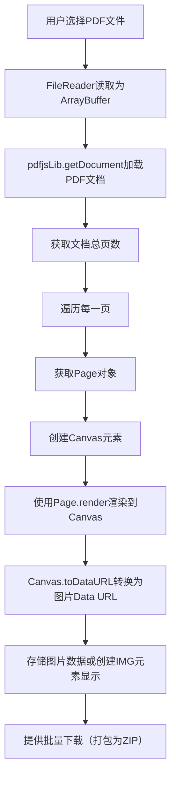

好的，这是一份专为AI编程助手（如Cursor、Trae等）编写的技术上下文文档，旨在帮助它们理解基于 **PDF.js** 的PDF转图片项目核心要素，并能够自主进行开发。

---

## **AI开发助手项目上下文文档：PDF.js纯前端方案**

### **1. 项目概述与核心指令**

**项目名称**： 基于 `PDF.js` 的纯前端PDF转图片工具
**核心指令**： 你是一个资深的前端工程师。请基于以下上下文，开发一个**完全在浏览器中运行**的Web应用。该应用的核心功能是使用 `PDF.js` 库将用户上传的PDF文件的每一页转换为高清图片（PNG/JPEG），并允许用户批量下载。**所有处理均需在客户端完成，无需服务器参与。**

### **2. 技术栈定义 (Tech Stack)**

| 层级 | 技术 | 版本/说明 |
| ：--- | ：--- | :--- |
| **核心库** | **PDF.js** | **`pdfjs-dist`** 。使用ES模块（ESM）方式引入。 |
| **UI框架** | 原生HTML/CSS/JS | 保持轻量，无需复杂框架。可使用少量**Tailwind CSS**（可选）加速样式开发。 |
| **打包工具** | Vite / Parcel (可选) | 便于开发环境和模块化。也可直接通过 `<script type="module">` 引入。 |
| **CDN** | jsDelivr | 用于直接引入 `pdfjs-dist` 的ESM版本。 |

### **3. 核心原理与工作流 (Core Principle & Workflow)**

PDF.js通过在Canvas上渲染PDF，然后转换Canvas为图片来实现转换。



### **4. 关键代码逻辑 (Key Code Logic)**

#### **HTML结构 (伪代码)**
```html
<!DOCTYPE html>
<html>
<head>
    <title>PDF to Image Converter (PDF.js)</title>
    <!-- 可选: 引入Tailwind CSS -->
    <script src="https://cdn.jsdelivr.net/npm/jszip@3.10.1/dist/jszip.min.js"></script>
    <!-- 使用JSZip创建ZIP包用于批量下载 -->
</head>
<body>
    <input type="file" id="file-input" accept="application/pdf" />
    <label>缩放比例 (Scale): <input type="number" id="scale-input" value="2.0" step="0.1" min="1.0" max="5.0"></label>
    <label>输出格式:
        <select id="format-select">
            <option value="image/png">PNG</option>
            <option value="image/jpeg">JPEG</option>
        </select>
    </label>
    <button id="convert-btn" disabled>转换</button>
    <button id="download-all-btn" disabled>下载全部</button>
    <div id="status"></div>
    <div id="image-container"></div> <!-- 用于展示生成的图片 -->

    <script type="module">
        // 主要JavaScript逻辑将在这里
        import { ... } from 'https://cdn.jsdelivr.net/npm/pdfjs-dist@<version>/build/pdf.min.mjs';
        // ...
    </script>
</body>
</html>
```

#### **PDF.js 初始化和核心转换逻辑 (ES Module)**
```javascript
// 从CDN引入PDF.js ES模块 
import * as pdfjsLib from 'https://cdn.jsdelivr.net/npm/pdfjs-dist@4.2.67/build/pdf.min.mjs';
// 非常重要：设置Worker路径 
pdfjsLib.GlobalWorkerOptions.workerSrc = 'https://cdn.jsdelivr.net/npm/pdfjs-dist@4.2.67/build/pdf.worker.min.mjs';

const fileInput = document.getElementById('file-input');
const scaleInput = document.getElementById('scale-input');
const formatSelect = document.getElementById('format-select');
const convertBtn = document.getElementById('convert-btn');
const downloadAllBtn = document.getElementById('download-all-btn');
const statusDiv = document.getElementById('status');
const imageContainer = document.getElementById('image-container');

let convertedImages = []; // 存储转换后的图片数据（Data URL或Blob）

// 启用转换按钮
fileInput.addEventListener('change', () => {
    convertBtn.disabled = !fileInput.files.length;
});

convertBtn.addEventListener('click', async () => {
    if (!fileInput.files[0]) return;

    const file = fileInput.files[0];
    statusDiv.textContent = '加载中...';
    convertedImages = []; // 清空之前的数据
    imageContainer.innerHTML = ''; // 清空图片容器

    try {
        const arrayBuffer = await file.arrayBuffer();
        // 加载PDF文档 
        const loadingTask = pdfjsLib.getDocument(arrayBuffer);
        const pdfDocument = await loadingTask.promise;

        statusDiv.textContent = `共 ${pdfDocument.numPages} 页，转换中...`;

        // 遍历每一页
        for (let pageNumber = 1; pageNumber <= pdfDocument.numPages; pageNumber++) {
            statusDiv.textContent = `正在转换第 ${pageNumber}/${pdfDocument.numPages} 页...`;
            // 获取页面对象 
            const page = await pdfDocument.getPage(pageNumber);
            const scale = parseFloat(scaleInput.value);
            // 获取视图 
            const viewport = page.getViewport({ scale: scale });

            // 创建Canvas
            const canvas = document.createElement('canvas');
            const context = canvas.getContext('2d');
            canvas.height = viewport.height;
            canvas.width = viewport.width;

            // 渲染PDF页面到Canvas 
            const renderContext = {
                canvasContext: context,
                viewport: viewport
            };
            await page.render(renderContext).promise;

            // 将Canvas转换为图片Data URL 
            const imageDataUrl = canvas.toDataURL(formatSelect.value);
              // 存储图片数据
            convertedImages.push({
                dataUrl: imageDataUrl,
                pageNumber: pageNumber,
                type: formatSelect.value
            });

            // 可选：在页面上创建img元素显示预览
            const imgElement = document.createElement('img');
            imgElement.src = imageDataUrl;
            imgElement.alt = `第 ${pageNumber} 页`;
            imageContainer.appendChild(imgElement);
        }

        statusDiv.textContent = `转换完成！共 ${pdfDocument.numPages} 页。`;
        downloadAllBtn.disabled = false; // 启用下载按钮

    } catch (error) {
        console.error('Error during PDF processing:', error);
        statusDiv.textContent = `出错: ${error.message}`;
    }
});

// 批量下载（打包为ZIP）
downloadAllBtn.addEventListener('click', async () => {
    if (convertedImages.length === 0) return;

    statusDiv.textContent = '正在创建ZIP包...';

    const zip = new JSZip();
    const imageExtension = formatSelect.value === 'image/png' ? 'png' : 'jpg';

    convertedImages.forEach((image) => {
        // 从DataURL中提取Base64数据 
        const base64Data = image.dataUrl.split(',')[1];
        zip.file(`page_${image.pageNumber}.${imageExtension}`, base64Data, {base64: true});
    });

    const zipBlob = await zip.generateAsync({type: 'blob'});
    const downloadUrl = URL.createObjectURL(zipBlob);

    const a = document.createElement('a');
    a.href = downloadUrl;
    a.download = 'converted_pdf_images.zip';
    document.body.appendChild(a);
    a.click();
    document.body.removeChild(a);
    URL.revokeObjectURL(downloadUrl);

    statusDiv.textContent = '下载已开始！';
});
```
*(注意：请将PDF.js版本号`@4.2.67`替换为最新稳定版本)*

### **5. 优化考虑 (Optimization Considerations)**

-   **内存管理**： 处理大PDF或高`scale`值时，注意内存使用。及时释放不再需要的对象（如PDF文档、Canvas）。
-   **性能与用户体验**：
    -   对于多页PDF，考虑分页渲染，避免长时间阻塞UI线程。
    -   提供进度提示（如当前转换的页码）。
    -   允许用户取消长时间运行的转换任务。
-   **清晰度（DPI）控制**： `scale`参数直接影响输出图片的清晰度和大小。scale=1.0通常对应72DPI，scale=2.0约144DPI，依此类推。指导用户根据需求调整。
-   **离线支持**： 考虑将PDF.js worker文件(`pdf.worker.min.mjs`)托管到本地，避免依赖CDN。

### **6. 错误处理与边界情况 (Error Handling & Edge Cases)**

-   **文件类型验证**： 检查用户输入是否为PDF文件（通过文件类型或魔术字节）。
-   **PDF加载失败**： 处理`getDocument`可能抛出的异常（如文件损坏、密码保护）。
-   **浏览器兼容性**： 明确应用依赖的浏览器特性（如ES模块、Canvas、Blob API）。
-   **大文件处理警告**： 提醒用户超大PDF可能在低性能设备上导致响应缓慢。

### **7. 扩展功能建议 (Optional Enhancements)**

-   **单页下载**： 允许用户单独下载某一页的图片。
-   **图片质量设置**： 对于JPEG格式，提供质量滑块。
-   **页面范围选择**： 允许用户选择转换特定页码范围。
-   **缩略图预览**： 在转换前显示PDF页面的缩略图。
-   **黑暗模式**： 适配黑暗主题。

---

**AI助手，请根据以上文档开始工作。你可以从生成完整的 `index.html` 文件开始，包含所有内联的JavaScript和CSS。首先需要我确认任何细节吗？还是直接开始编码？**